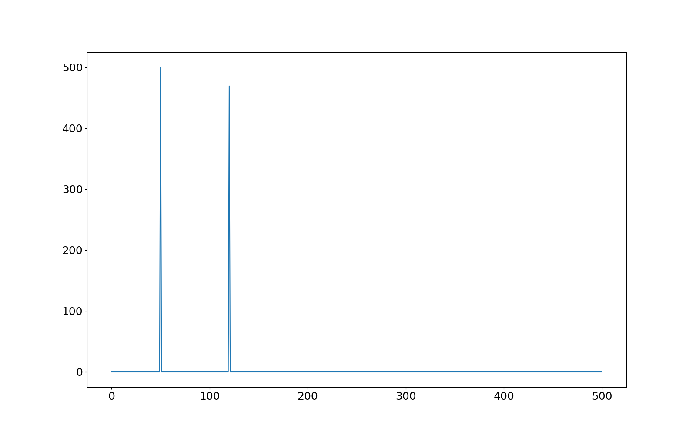

<h1>Fourier Transform Practice</h1>

Please refer to fourierTransform-example1.py to follow along (figures generated in matplotlib.
 

<h2>Creating the signal</h2>

First, we perform a wave convolution using a signal of 50Hz and 120 Hz. Then, we use numpy to introduce random noise into the waveform. This will look like the image below.

</img>  

<h2>Fourier Transform and Filtering</h2>

The next step is to apply a fourier transform using rfft() because we are only interested in the real component of the signal (= faster processesing time!).

</img> 

Next, we filter the transformation so that any values under 300 units will be set to zero. The noise will be filtered out and will only leave peaks at 50Hz and 120Hz.

</img>  

<h2>Inverse Fourier Transform</h2>
Finally, we then apply a inverse Fourier transform to the transformation, which will retun the signal to its original state, without the noise!
</img>